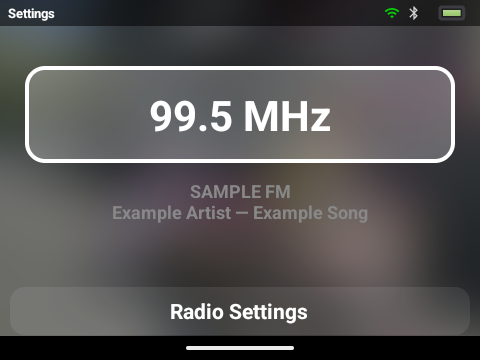
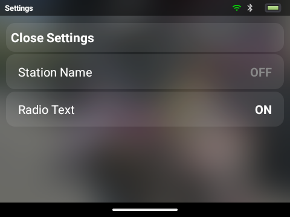

# Optional FM station information

Radio → Radio Settings → Extended Information has two independent switches:

- Station Name: the broadcaster's RDS program-service label.
- Radio Text: broadcaster text, which may contain song/artist or announcements.

Both default Off. Either enables the existing vendor RDS API while FM is active; both Off stop the reader. Retuning/scanning clears old metadata, and FM shutdown disables RDS and cancels polling. Unsupported RDS leaves audio playback working. No extra wake lock, artwork lookup, or network request is added.

## Emulator preview

Android 35 ARM64 emulator at 480×360. Text is simulated in a temporary emulator-only APK, not the production source or Y1 release. The emulator cannot test the MediaTek tuner.

## Validation

12 JVM/Robolectric tests cover optional support/failure, text decoding, field selection, preference migration, reader shutdown, retune/scan reset. Emulator checks cover layout, independent selection, stored preferences and submenu Back navigation. Local release lint and signed ARMv7 APK/ROM checks pass.

## Y1 test

1. Plug in wired headphones and tune a strong known RDS station.
2. Enable each switch separately, then both; check station label/text.
3. Disable both: frequency/audio remain, metadata disappears.
4. Retune/scan and toggle FM Off/On; old text must clear.
5. Let the physical display timeout expire, wake it and check audio plus updated text.
6. Test a station without RDS and restart the app to check preference persistence.

RDS reception is not yet device-verified. Initial decoding supports basic Latin; extended RDS characters still need the full character-table mapping. Native reads may also wait during a vendor subsystem reset, so stress retune/off-on with poor reception on the Y1 before marking the PR ready.
